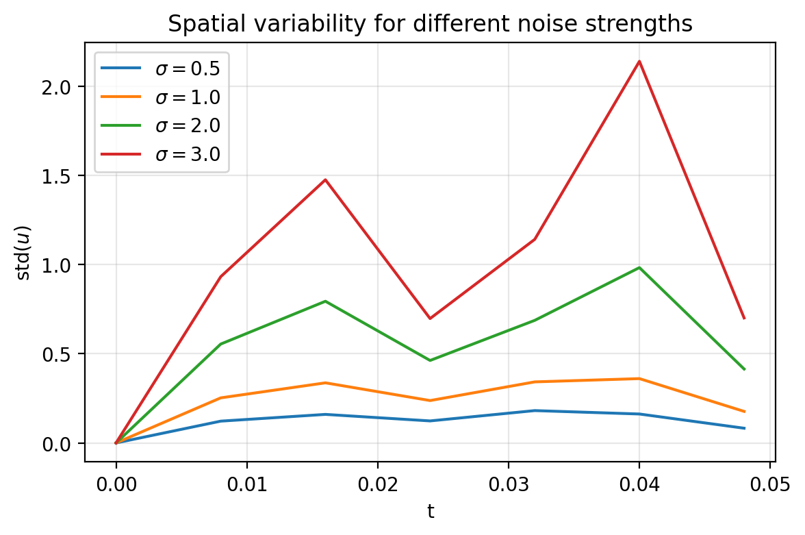
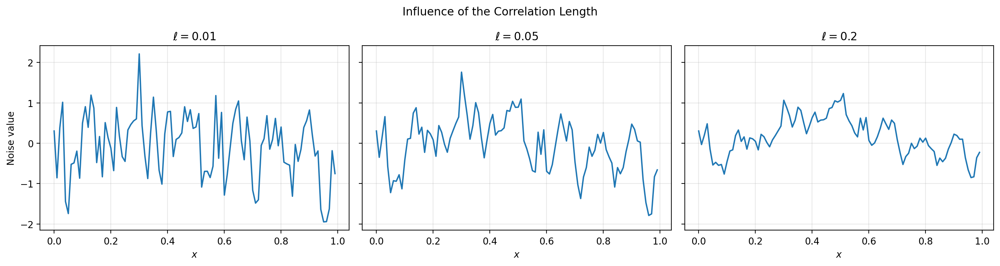
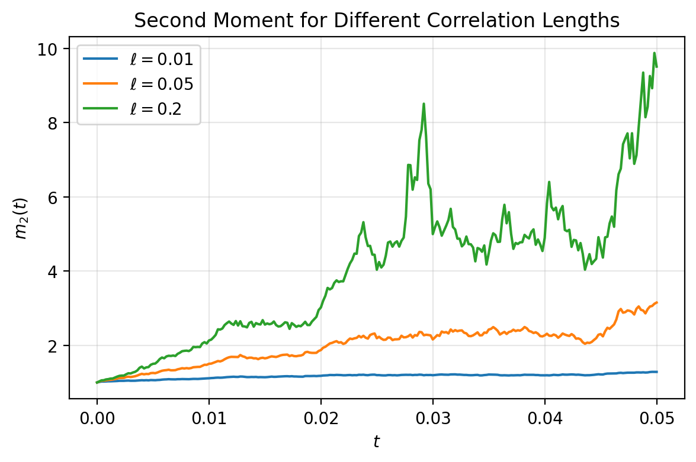

# Numerical Experiments for the Parabolic Anderson Model

This project develops a numerical exploration of the heat equation and the parabolic Anderson model (PAM), progressing from deterministic finite-difference methods to stochastic forcing, Monte Carlo simulation, and spatially correlated Gaussian noise.

The goal is to connect the stochastic PDEs that motivate my research with numerical simulation in Python and to study how randomness affects solution behavior and moment statistics.

## Model

The stochastic heat equation considered throughout the later notebooks has the form

```math
\partial_t u(t,x)
=
\kappa \Delta u(t,x)
+
\sigma u(t,x)\xi(t,x).
```

on a one-dimensional periodic domain, where $\xi$ denotes the stochastic forcing.

The project also considers spatially correlated Gaussian noise with covariance

```math
Q(x,y)
=
\exp\left(
-\frac{d(x,y)}{\ell}
\right),
```

where $d(x,y)$ is the periodic distance and $\ell$ controls the correlation length.

## Selected Results

### Effect of Noise Strength

<p align="center">
  
</p>

Increasing the multiplicative noise strength produces greater spatial variability in the stochastic solution.

### Spatial Correlation



Using the same underlying Gaussian sample, different correlation lengths produce visibly different spatial structures, with larger values of $\ell$ extending the range of spatial dependence.

### Second-Moment Behavior

<p align="center">
  
</p>

Monte Carlo simulation shows that the second-moment behavior depends on the spatial covariance structure of the driving noise.

## Numerical Methods

The simulations use:

- finite differences with a periodic discrete Laplacian,
- explicit Euler time stepping for the deterministic heat equation,
- Euler--Maruyama discretization for stochastic forcing,
- Monte Carlo simulation for empirical statistics and moments,
- covariance matrices for spatially correlated Gaussian noise, and
- Cholesky factorization for generating correlated Gaussian samples.

The implementation uses Python, NumPy, and Matplotlib.

## Notebooks

### 1. Discrete Laplacian and Heat Equation

Introduces the periodic spatial grid and discrete Laplacian and solves the deterministic heat equation using an explicit finite-difference scheme.

### 2. Heat Equation and Static PAM

Adds a fixed random spatial potential to the heat equation and studies how the potential strength affects the solution.

### 3. Stochastic Heat Equation and Noise Strength

Replaces the static potential with multiplicative stochastic forcing and studies individual solution paths as the noise strength varies.

### 4. Monte Carlo for the Stochastic Heat Equation

Moves from individual realizations to repeated simulations and studies empirical solution statistics and moments under different noise strengths.

### 5. Spatially Correlated Gaussian Noise

Constructs Gaussian random fields with periodic exponential covariance and investigates how the correlation length changes their spatial structure.

### 6. Colored Noise in the Stochastic Heat Equation

Uses spatially correlated Gaussian noise to drive the stochastic heat equation and compares the resulting solutions with the white-noise case.

### 7. Moments of the Stochastic Heat Equation

Computes spatial moments along individual realizations, estimates ensemble moments using Monte Carlo simulation, and compares second-moment behavior across different correlation lengths.

## Main Observations

The numerical experiments illustrate several features of the model:

- multiplicative stochastic forcing produces increasingly pronounced fluctuations as the noise strength increases;
- Monte Carlo averaging separates ensemble behavior from the variability of individual sample paths;
- spatial correlation changes the spatial structure of both the driving noise and the resulting stochastic solution;
- increasing the correlation length extends the range of spatial dependence; and
- the second moment is sensitive to both stochastic forcing and the covariance structure of the noise.

These experiments are performed over relatively short simulation horizons, so the numerical results are intended to illustrate finite-time behavior rather than establish asymptotic growth rates.

## Repository Structure

```text
PAM_Numerical_Project/
├── 01_discrete_laplacian_and_heat_equation.ipynb
├── 02_heat_equation_and_static_PAM.ipynb
├── 03_stochastic_heat_equation_and_noise_strength.ipynb
├── 04_monte_carlo_for_the_stochastic_heat_equation.ipynb
├── 05_spatially_correlated_gaussian_noise.ipynb
├── 06_colored_noise_in_the_stochastic_heat_equation.ipynb
├── 07_moments_of_the_stochastic_heat_equation.ipynb
├── figures/
│   ├── noise_strength_comparison.png
│   ├── correlation_length_comparison.png
│   └── second_moment_correlation_length.png
└── README.md
```

## Running the Notebooks

The project requires:

```text
numpy
matplotlib
jupyter
```

The notebooks are designed to be read in numerical order, with each notebook building on the ideas introduced previously.

To launch JupyterLab locally:

```bash
jupyter lab
```

## Motivation

My research is in stochastic analysis and stochastic partial differential equations. This project provides a computational counterpart to that work by implementing numerical experiments for stochastic heat equations and related parabolic Anderson models.

Rather than aiming for a full numerical SPDE library, the project focuses on transparent implementations that make the connection between the mathematical model, numerical discretization, and observed stochastic behavior explicit.